=====================
EmComMap Installation
=====================

* App can be encrypted (https) or unencrypted (http) which is required for amateur radio
* Can be installed on any webserver whether internet facing or private (ex. MESH networking)
* Relies on three server platforms, each of which can be deployed redundantly to avoid single points of failure

    - :ref:`CouchDB`
    - :ref:`Map Tile Server`
    - :ref:`Web Server` (e.g. Apache2 or nginx)

.. _CouchDB:

CouchDB
-------

CouchDB can be installed on Linux, Mac and Windows. CouchDB can also be installed in **Standalone** or **Clustered** mode. We will just cover a Linux standalone installation in this document. For more information on Mac and Windwos or creating a clustered installation, please visit the official `CouchDB website <https://couchdb.apache.org>`_.

If you are running one of the following versions of Linux, the easiest way to install is using the binary packages.

* :ref:`Debian 9 (stretch)`
* :ref:`Debian 10 (buster)`
* :ref:`Ubuntu 16.04 (xenial)`
* :ref:`Ubuntu 18.04 (bionic)`
* :ref:`Ubuntu 20.04 (focal)`
* :ref:`CentOS`
* :ref:`Raspberry OS`
* :ref:`Docker`

.. _Debian 9 (stretch):

Debian 9 (stretch)
++++++++++++++++++

1. Start by enabling the Apache CouchDB package repository ::

    sudo apt-get install -y apt-transport-https gnupg ca-certificates
    
 ::

    echo "deb https://apache.bintray.com/couchdb-deb stretch main" | sudo tee /etc/apt/sources.list.d/couchdb.list
    
2. Install the CouchDB GPG key ::

    sudo apt-key adv --keyserver keyserver.ubuntu.com --recv-keys 8756C4F765C9AC3CB6B85D62379CE192D401AB61
    
3. Update the repository and install the CouchDB package ::

    sudo apt update && sudo apt install -y couchdb

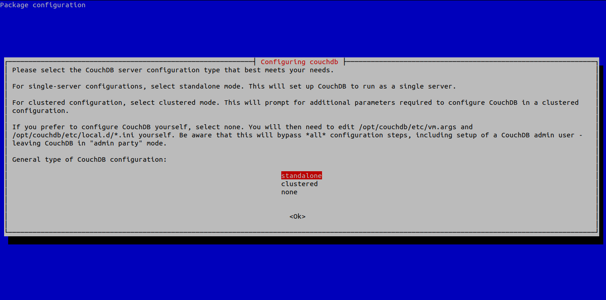
    
4. When prompted, configure CouchDB for **Standalone** operation.
 
 |
 |
 |
 |
 |
 |
 |
 |
 
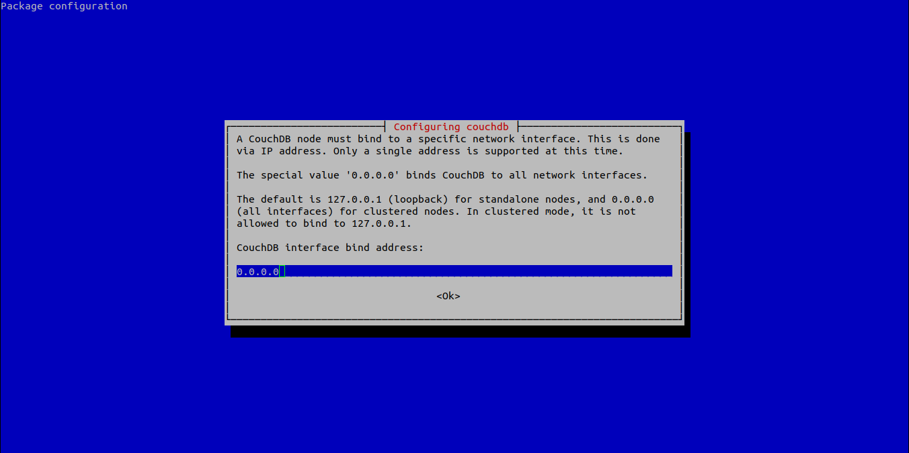
    
5. Set **Bind** address to ``0.0.0.0``

 |
 |
 |
 |
 |
 |
 |
 |
 
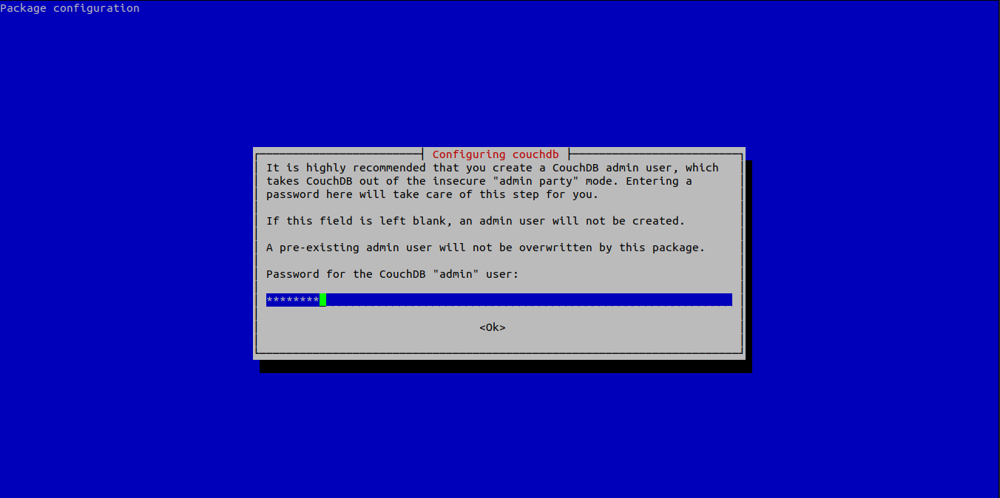
    
6. Set a password for the CouchDB **Admin** account

.. _Debian 10 (buster):

Debian 10 (buster)
++++++++++++++++++

1. Start by enabling the Apache CouchDB package repository ::

    sudo apt-get install -y apt-transport-https gnupg ca-certificates
    
 ::

    echo "deb https://apache.bintray.com/couchdb-deb buster main" | sudo tee /etc/apt/sources.list.d/couchdb.list
    
2. Install the CouchDB GPG key ::

    sudo apt-key adv --keyserver keyserver.ubuntu.com --recv-keys 8756C4F765C9AC3CB6B85D62379CE192D401AB61
    
3. Update the repository and install the CouchDB package ::

    sudo apt update && sudo apt install -y couchdb

4. When prompted, configure CouchDB for **Standalone** operation.
 
 |
 |
 |
 |
 |
 |
 |
 |
 

    
5. Set **Bind** address to ``0.0.0.0``

 |
 |
 |
 |
 |
 |
 |
 |

    
6. Set a password for the CouchDB **Admin** account

.. _Ubuntu 16.04 (xenial):

Ubuntu 16.04 (xenial)
+++++++++++++++++++++

1. Start by enabling the Apache CouchDB package repository ::

    sudo apt-get install -y apt-transport-https gnupg ca-certificates
    
 ::

    echo "deb https://apache.bintray.com/couchdb-deb xenial main" | sudo tee /etc/apt/sources.list.d/couchdb.list
    
2. Install the CouchDB GPG key ::

    sudo apt-key adv --keyserver keyserver.ubuntu.com --recv-keys 8756C4F765C9AC3CB6B85D62379CE192D401AB61
    
3. Update the repository and install the CouchDB package ::

    sudo apt update && sudo apt install -y couchdb
    
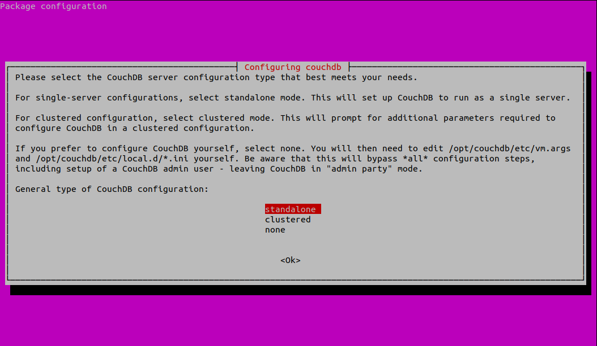
    
 4. When prompted, configure CouchDB for **Standalone** operation.
 
 |
 |
 |
 |
 |
 |
 |
 |
 |
 |
 
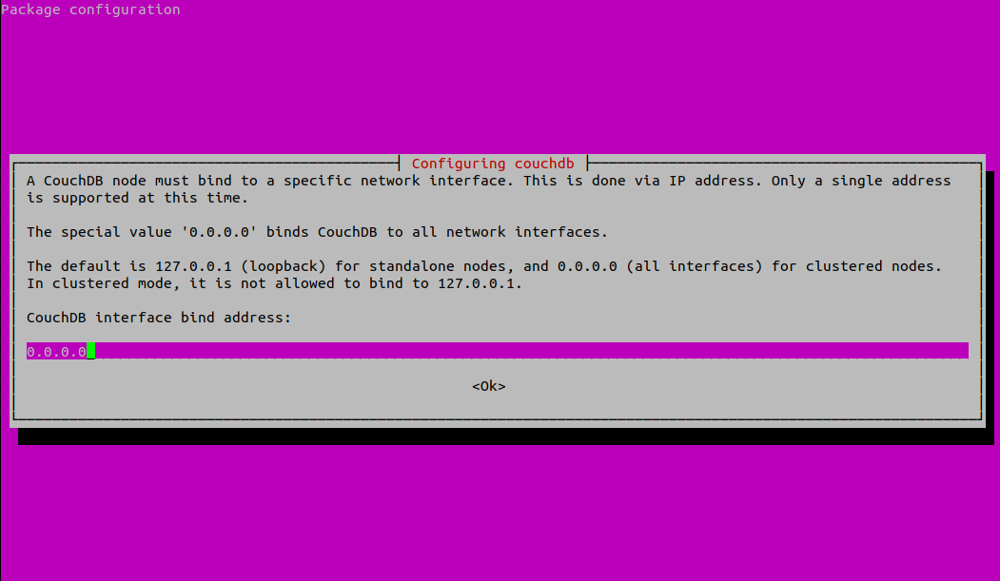
    
5. Set **Bind** address to ``0.0.0.0``

 |
 |
 |
 |
 |
 |
 |
 |
 |
 |
 
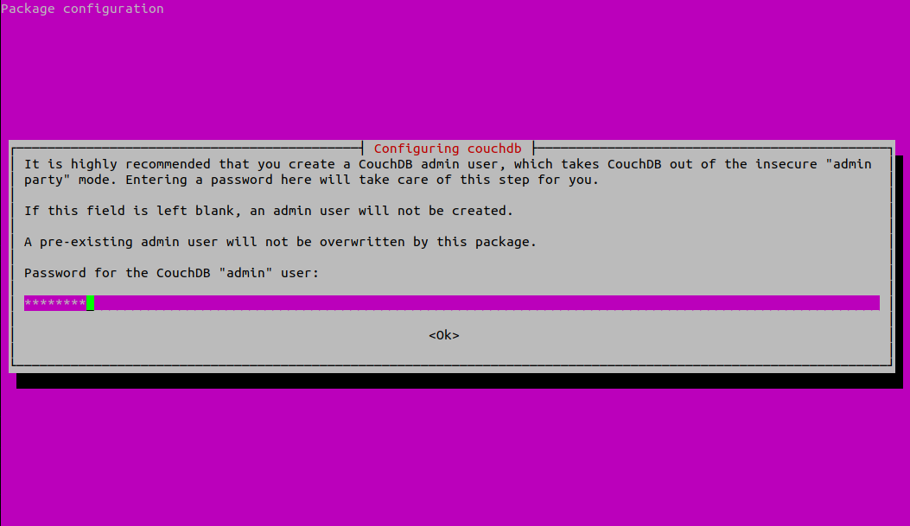
    
6. Set a password for the CouchDB **Admin** account

.. _Ubuntu 18.04 (bionic):

Ubuntu 18.04 (bionic)
+++++++++++++++++++++

1. Start by enabling the Apache CouchDB package repository ::

    $ sudo apt-get install -y gnupg ca-certificates
    
 ::

    echo "deb https://apache.bintray.com/couchdb-deb bionic main" | sudo tee /etc/apt/sources.list.d/couchdb.list
    
2. Install the CouchDB GPG key ::

    sudo apt-key adv --keyserver keyserver.ubuntu.com --recv-keys 8756C4F765C9AC3CB6B85D62379CE192D401AB61
    
3. Update the repository and install the CouchDB package ::

    sudo apt update && sudo apt install -y couchdb
    

    
 4. When prompted, configure CouchDB for **Standalone** operation.
 
 |
 |
 |
 |
 |
 |
 |
 |
 |
 |
 

    
5. Set **Bind** address to ``0.0.0.0``

 |
 |
 |
 |
 |
 |
 |
 |
 |
 |
 

    
6. Set a password for the CouchDB **Admin** account

.. _Ubuntu 20.04 (focal):

Ubuntu 20.04 (focal)
++++++++++++++++++++

1. Start by enabling the Apache CouchDB package repository ::

    sudo apt-get install -y gnupg ca-certificates
    
 ::

    echo "deb https://apache.bintray.com/couchdb-deb focal main" | sudo tee /etc/apt/sources.list.d/couchdb.list
    
2. Install the CouchDB GPG key ::

    sudo apt-key adv --keyserver keyserver.ubuntu.com --recv-keys 8756C4F765C9AC3CB6B85D62379CE192D401AB61
    
3. Update the repository and install the CouchDB package ::

    sudo apt update && sudo apt install -y couchdb
    

    
 4. When prompted, configure CouchDB for **Standalone** operation.
 
 |
 |
 |
 |
 |
 |
 |
 |
 |
 |
 

    
5. Set **Bind** address to ``0.0.0.0``

 |
 |
 |
 |
 |
 |
 |
 |
 |
 |
 

    
6. Set a password for the CouchDB **Admin** account

.. _CentOS:

CentOS
++++++

1. Using your text editor, place the following into ``/etc/yum.repos.d/bintray-apache-couchdb-rpm.repo`` to enable the CouchDB repository ::

    [bintray--apache-couchdb-rpm]
    name=bintray--apache-couchdb-rpm
    baseurl=http://apache.bintray.com/couchdb-rpm/el$releasever/$basearch/
    gpgcheck=0
    repo_gpgcheck=0
    enabled=1
    
2. Install the CouchDB packages ::

    sudo yum -y install epel-release && sudo yum -y install couchdb

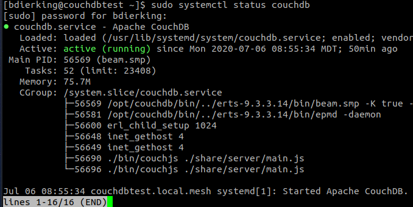

3. Enable CouchDB to start on boot, then start CouchDB and verify it is running ::

    sudo systemctl enable couchdb
    
 ::

    sudo systemctl start couchdb
    
 ::

    sudo systemctl status couchdb

|

4. Using your text editor, open this file ``/opt/couchdb/etc/local.ini``

5. Scroll down to the **[admins]** section and uncomment the following line and change the default password ::

    [admins]
    admin = mypassword
    
6. Now scroll up to the **[chttpd]** section and uncomment the **port** and **bind_address** values. Set the **bind_address** value to ``0.0.0.0``. This allows access from other computers on your LAN. For security issues, this can be changed later to the IP address of your web server hosting the EmComMap web application. ::

    [chttpd]
    port = 5984
    bind_address = 0.0.0.0
    
7. Save the changes and exit then restart CouchDB for changes to take effect ::

    sudo systemctl restart couchdb
    
8. If you are running **firewalld** on the server (usually installed by default), you will need to open port 5984 to allow CouchDB traffic ::

    sudo firewall-cmd --zone=public --permanent --add-port=5984/tcp
    
 ::
    
    sudo firewall-cmd --reload

.. _Raspberry OS:

Raspberry OS
++++++++++++

1. Install the dependencies ::

    sudo apt-get --no-install-recommends -y install build-essential pkg-config erlang libicu-dev libmozjs185-dev libcurl4-openssl-dev
    
   Be sure to update the version numbers to match your system’s available packages.
   
    
2. Download the CouchDB source package ::

    wget http://apache.mirrors.hoobly.com/couchdb/source/3.1.0/apache-couchdb-3.1.0.tar.gz
    
3. Decompress the file ::

    tar -zxvf apache-couchdb-3.1.0.tar.gz
    
4. Change to the **couchdb** directory ::

    cd couchdb
    
5. Verify that all the dependencies are installed to build CouchDB ::

    ./configure
    
   If everything was successful, you will receive the message ::
    
    You have configured Apache CouchDB, time to relax.
    
6. Build CouchDB ::

    make release
    
   If everything was successful, you will receive the following message ::
    
    ... done
    You can now copy the rel/couchdb directory anywhere on your system.
    Start CouchDB with ./bin/couchdb from within that directory.
    
7. Create a special user for CouchDB ::

    sudo adduser --system --shell /bin/bash --group --gecos "CouchDB Administrator" couchdb
    
8. Copy the built CouchDB release to the **couchdb** user's home directory ::

    sudo cp -R /path/to/couchdb/rel/couchdb /home/couchdb
    
9. Change ownership of the CouchDB directories ::

    sudo chown -R couchdb:couchdb /home/couchdb
    
10. Change the permission of the CouchDB directories ::

    sudo find /home/couchdb -type d -exec chmod 0770 {} \;
    
11. Change permissions of the CouchDB ini files ::

    sudo chmod 0644 /home/couchdb/etc/*

12. If you would like, you may remove unnecessary files (the .gz file and build directory in the **pi** user's home folder and not the **couchdb** user's home folder)

.. _Docker:

Docker
++++++

There are two ways to setup a container. First one lets Docker manage the file storage location inside the container. The second allows you to store the data files outside the container in a "persistent" manner making it easier for tools and applications to access the files. This is also more secure if the container fails or is shutdown accidently without backing up the data files.

The preferred method would be to create a data directory on the host system (outside the container) and mount this to a directory visible from inside the container. This places the database files in a known location on the host system, and makes it easy for tools and applications on the host system to access the files. The downside is that the user needs to make sure that the directory exists, and that directory permissions and other security mechanisms on the host system are set up correctly.

* To start a basic CouchDB container ::

    docker run -d --name <desired name> -p 5984:5984 -e COUCHDB_USER=admin -e COUCHDB_PASSWORD=<desired password> --restart always couchdb:latest
 
* To launch a CouchDB container with persistent file storage ::

    docker run -d --name <desired name> -p 5984:5984 -e COUCHDB_USER=admin -e COUCHDB_PASSWORD=<desired password> -v /home/couchdb/data:/opt/couchdb/data --restart always couchdb:latest

.. _Map Tile Server:

Map Tile Server
---------------

Maps are powered by OpenStreeMap data. They are ready to use and not need to render the tiles after download.

1. Install Docker with the following command ::

    curl -sSL https://get.docker.com/ | sh
    
2. Make a directory to store your map tile file and then change directory to it ::

    mkdir openmaptiles
    
 ::

    cd openmaptiles
    
3. Launch a Docker container with the following command. It will download the OpenMapTiles-Server container image from the Docker Hub and launch the OpenMapTiles-Server container in **detached** mode and will restart the container when system is rebooted for any reason. Detached mode allows the program to launch without leaving a terminal window open. ::

    docker run -dit --name <disiredservername> -v $(pwd):/data -p 8080:80 --restart always klokantech/openmaptiles-server

.. warning:: The Docker OpenMapTiles container **MUST** be run from the directory you created above.

|

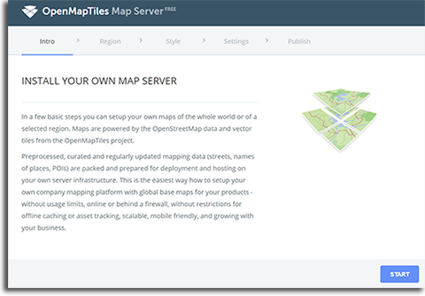

4. Open a web browser and navigate to **http://<hostname or IP>:8080/** and click **START**

|
|
|
|
|
|
|
|
|

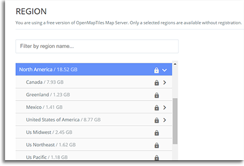

5. Select the region that you want to install the tiles for and then click **CONTINUE**.  Most regions will require you to setup a free account on the `OpenMapTiles website <https://openmaptiles.org>`_

|
|
|
|
|
|
|

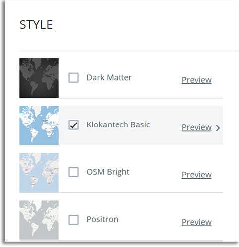
    
6. Uncheck all but **Klokantech Basic** and click **CONTINUE**

|
|
|
|
|
|
|
|
|
|
|
|
|
|
|
|
|
|

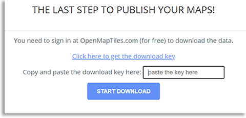
    
7. Click **Click here to get the download key**. You will be taken to the OpenMapTiles site. It will walk you through signing up for a free account if you don't already have one and then provide you with a **DOWNLOAD KEY**. Copy and paste it into the form and click **START DOWNLOAD**.

8. Once the download has completed, click **OPEN MAP SERVER**.

.. _Web Server:

Web Server
----------

You can run whichever webserver you like but we will be using Apache2 for this example.

Ubuntu/Debian
+++++++++++++

1. Run the following command to install **Apache2** ::

    sudo apt install -y httpd

2. Change directory to ``/var/www/html`` and download EmComMap ::

    cd /var/www/html
    
 ::

    $ sudo git clone https://github.com/DanRuderman/EmComMap.git

3. Restart the Apache2 webserver ::

    sudo apache2ctl restart

CentOS
++++++

1. Run the following commands to update the **httpd** package index and install **httpd** (Apache2) ::

    sudo yum update httpd && sudo yum install httpd

2. Start your web server. Apache does not start automatically on CentOS once the installation completes. ::
    
    sudo systemctl start httpd
    
3. Confirm Apache is running ::
    
    sudo systemctl status httpd
    
4. Change directory to ``/var/www/html`` and download EmComMap ::

    cd /var/www/html
    
 ::

    sudo git clone https://github.com/DanRuderman/EmComMap.git

5. Restart the Apache2 webserver ::

    sudo apache2ctl restart

Raspberry OS
++++++++++++

1. Update the available packages ::

    sudo apt update
    
2. Install the **Apache2** package ::

    sudo apt install apache2 -y

3. Test the install by opening a web browser and going to ``http://<hostname or IP>:8080``. You should see this page.

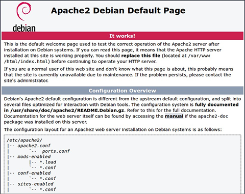

4. Change directory to ``/var/www/html`` and download EmComMap ::

    cd /var/www/html
    
 ::

    sudo git clone https://github.com/DanRuderman/EmComMap.git

5. Restart the Apache2 webserver ::

    sudo apache2ctl restart

Docker
++++++

Just like with the CouchDB Docker installation, there are two ways to setup a container. First one lets Docker manage the file storage location inside the container. The second allows you to store the data files outside the container in a "persistent" manner making it easier for tools and applications to access the files. This is also more secure if the container fails or is shutdown accidently without backing up the data files.

The preferred method would be to create a data directory on the host system (outside the container) and mount this to a directory visible from inside the container. This places the database files in a known location on the host system, and makes it easy for tools and applications on the host system to access the files. The downside is that the user needs to make sure that the directory exists, and that directory permissions and other security mechanisms on the host system are set up correctly.

1a. To launch a basic Apache web server container ::

    docker run -dit --name <desired name> -p 8080:80 httpd:2.4
    
1b. To launch a persistent Apache web server container ::

    docker run -dit --name <desired name> -p 8080:80 -v /path/to/data/folder:/usr/local/apache2/htdocs/ httpd:2.4

3. Test the install by opening a web browser and going to ``http://<hostname or IP>:8080``. You should see this page.

4. Change directory to ``/var/www/html`` and download EmComMap ::

    cd /var/www/html
    
 ::

    sudo git clone https://github.com/DanRuderman/EmComMap.git

5. Restart the Apache2 webserver ::

    sudo apache2ctl restart

.. _CouchDB Configuration:

CouchDB Configuration
---------------------

1. Open a web browser and go to ``http://<address or IP>:5984/_utils/``

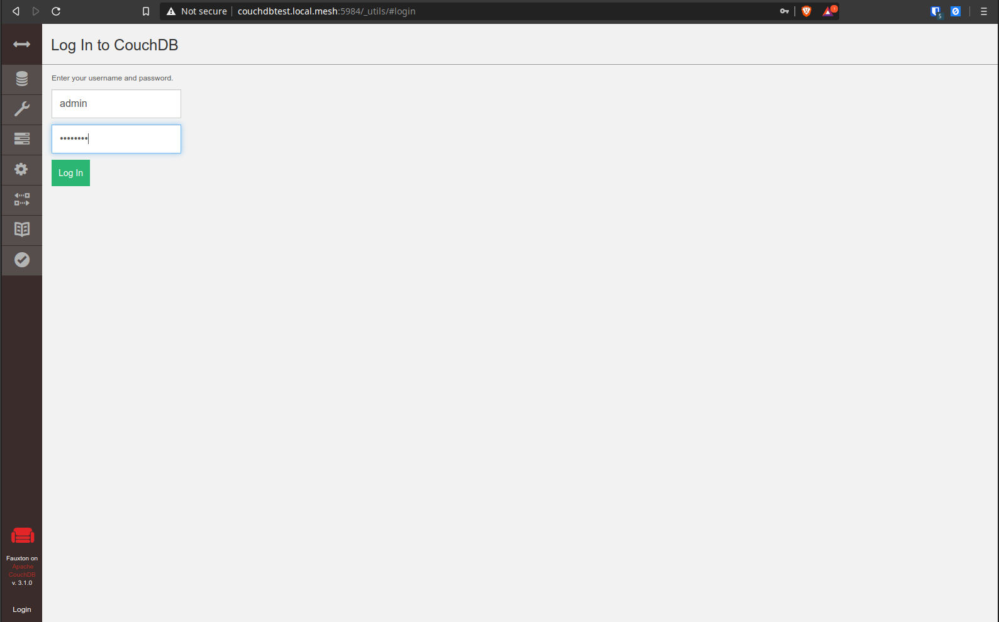
    
2. Login to the Fauxton CouchDB web administration console using the account **admin** and the password you set during install.

|
|
|
|
|

3. On the left side click on the **Configure** link (gear icon)

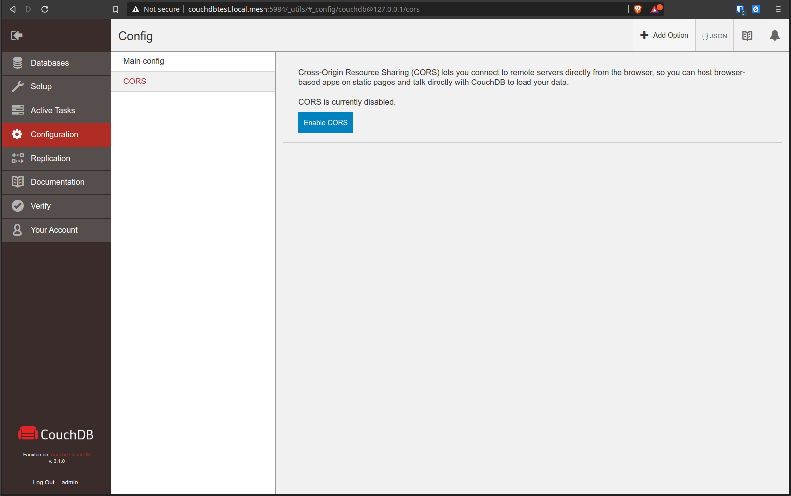

4. Click on **CORS** and click **Enable**

|
|
|
|
|
|
|
|
|
|

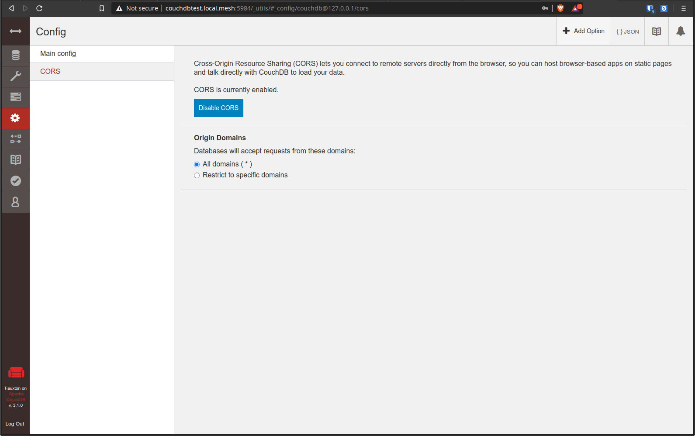

5. Click **All Domains**

|
|
|
|
|
|
|
|
|
|
|

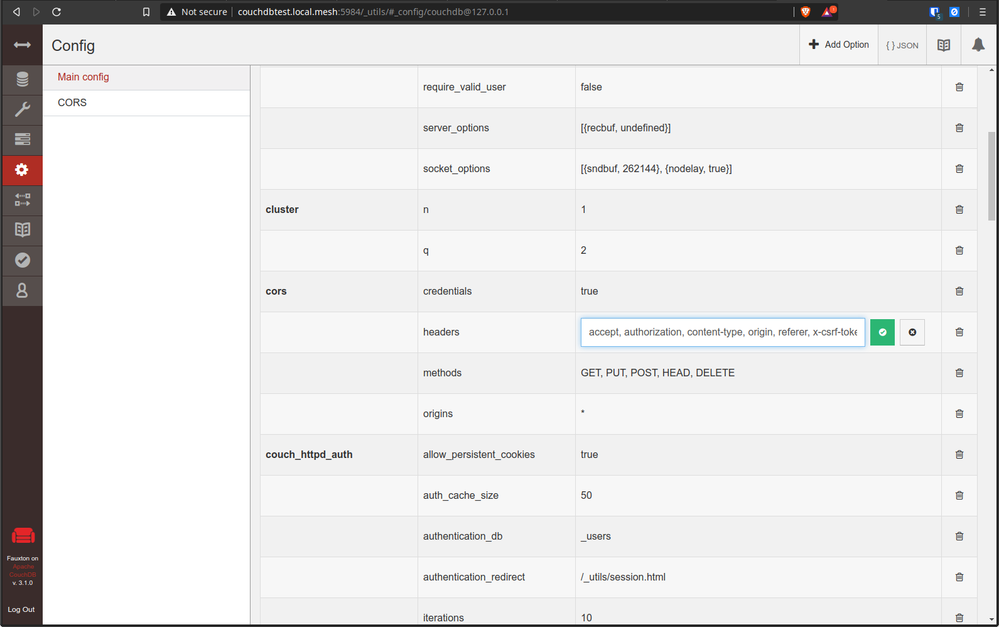

6. Click **Main Config** then scroll down to the **CORS** section

7. In the **CORS** section, click on the **Value** to the right of **Headers** to edit that entry

8. To the end of that entry, add ``, x-csrf-token`` and click the green check mark to save

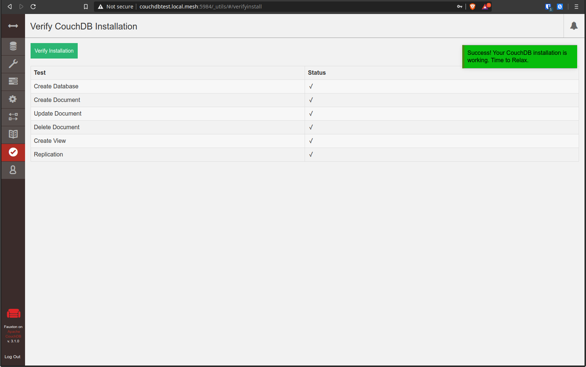
    
9. Verify CouchDB installation by clicking on the **Verify** menu icon on the left and then click **Verify Installation**

|
|
|
|
|
|

Create Databases
++++++++++++++++

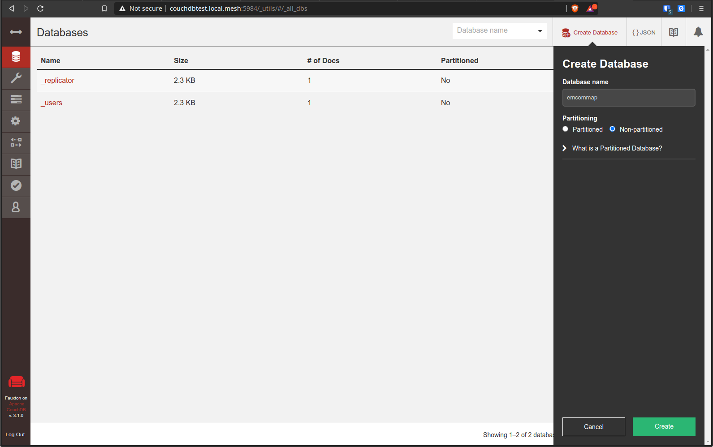
    
10. Click on the **Databases** menu icon on the left then click on **Create Database** on the top-left of the page

11. Enter ``emcommap`` for **Database Name**

12. Select **Non-partitioned**

13. Click **Create**

14. Create another database using the same options called ``emcommap_attachments``

|

15. Open the **emcommap** database by clicking on it.

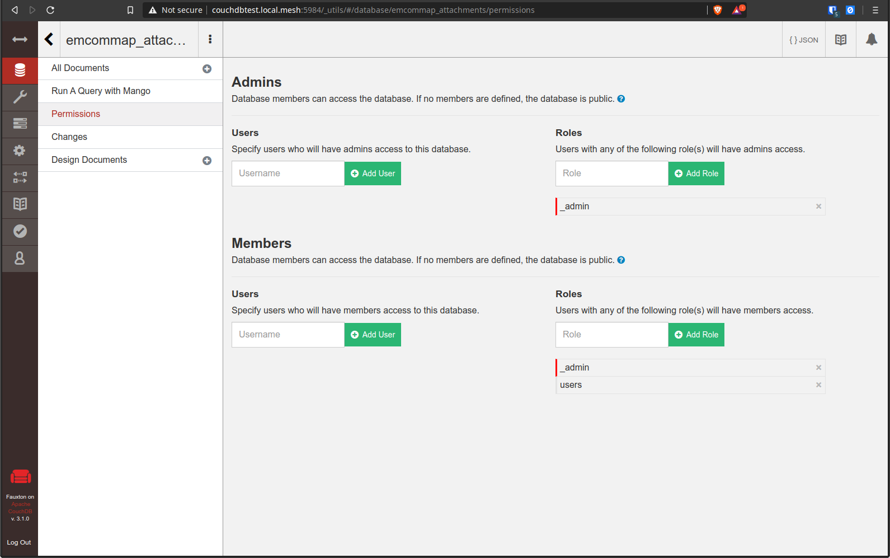
    
16. Click on **Permissions** on the left

17. Under **Roles**, type ``users`` into the box and click **Add Role**

18. Now add the role **users** to the **emcommap_attachments** database

Create Users
++++++++++++

19. Click on the **_users** database to open

20. Click on the green **Create Document** button on the top-right of the page
    
21. Paste in the following inbetween the ``{}`` overwriting what is already in the document ::

    "_id": "org.couchdb.user:username",  
    "name": "name_of_user",  
    "type": "user",  
    "roles": [],  
    "password": "plaintext_password"  

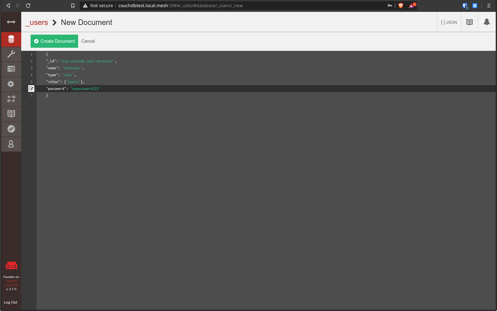
    
22. Change ``username`` to the desired username of the user

23. Change ``name_of_user`` to the desired username of the user **THESE MUST MATCH**

24. Within the ``[]`` next to **roles**, type ``"users"``

25. Change ``plaintext_password`` to the desired password of the user

26. Click **Create Document**

Repeat these steps for all desired users.

EmComMap Configuration
----------------------

1. Open the file ``/var/www/html/EmComMap/html/config.js`` in a text editor ::

    sudo vim /var/www/html/EmComMap/html/config.js
    
2. Towards the top of the file you will see these lines ::

    const RUN_LOCATION = "local";

    if(RUN_LOCATION == "my-install") {
        var TILE_SERVER = 'http://<host>:8080/styles/klokantech-basic/{z}/{x}/{y}.png';
        var TILE_SERVER_OPTS = {
        maxZoom: 18,
        attribution: 'Map data &copy; <a href="https://www.openstreetmap.org/">OpenStreetMap</a> contributors, ' +
            '<a href="https://creativecommons.org/licenses/by-sa/2.0/">CC-BY-SA</a>, ' +
            'Server courtesy of <a href="https://openmaptiles.com/">OpenMapTiles</a>'
        };
        var DEFAULT_DB_HOST = '<host>';
        
3. Change the **RUN_LOCATION** string to ``my-install`` instead of ``local``

4. Change both instances of ``<host>`` to the hostname or IP of your EmComMap server.

.. note:: If you have the CouchDB server on a different computer, then you will need to use that computer's address for **DEFAULT_DB_HOST**.

.. note:: If your deployment is for testing only set the value of **TEST_MODE** to ``true`` in ``config.js``. This will put the text **TESTING** in bold red font at the top of the application and precede all messages with **TESTING:**. The purpose is to ensure that test traffic is not mistaken for a real-world emergency.

